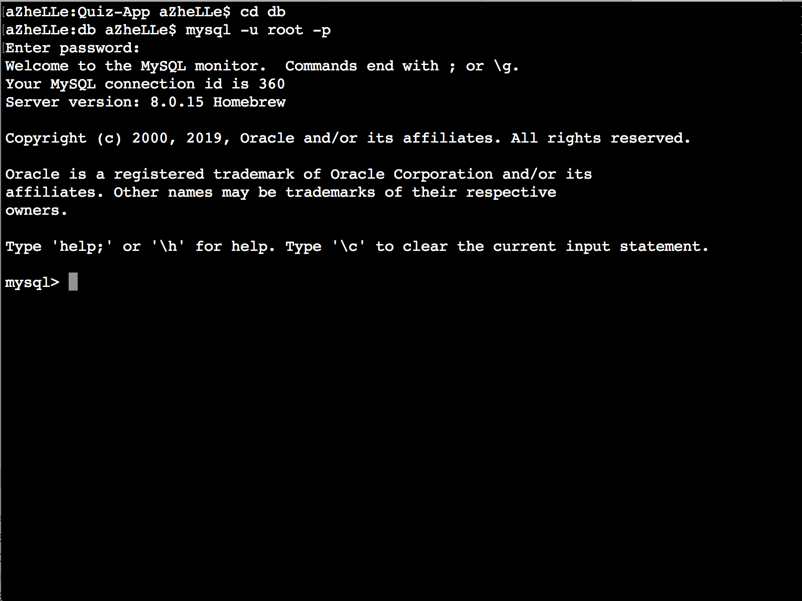

# Triviosa

## Description

Triviosa is a single player trivia game.

On sign-up the user creates an account with a unique username and selects a team of their choice. The player is then able to select a difficulty level to play a quiz related to the topic they choose.

Each question correctly answered adds random points to both your and your team's score. At the end of each game, you can see your score, rank and the overall ranking of your team. You can also checkout the Leaderboard to see the scores and rankings of all the players and teams.

This game was developed as a project for the UC Berkeley Coding Bootcamp, San Francisco.

## Packages Used

Require - _https://www.npmjs.com/package/require_

MySQL - _https://www.npmjs.com/package/mysql_

Express - _https://www.npmjs.com/package/express_

Body-Parser - _https://www.npmjs.com/package/body-parser_

Method-Override - _https://www.npmjs.com/package/method-override_

Express-Session - _https://www.npmjs.com/package/express-session_

Cookie Parser - _https://www.npmjs.com/package/cookie-parser_

MD5 - _https://www.npmjs.com/package/md5_

DotEnv - _https://www.npmjs.com/package/dotenv_

## System Requirements

1. NodeJS - version 10 and up

2. MySQL - version 8.0 

## Setting Up The Application

1. Downloading The App

2. Install The Packages Listed 

	- Using the _package.json_ file, run _"npm install"_ inside the Quiz-App folder (see Figure 1)
		- if _"npm audit fix"_ shows up, just run the command after the installation 	
	- The packages listed above should be inside _"node\_modules"_ folder to make the app work. Otherwise, you have to manually download the package (Use the link to see instruction) (see Figure 2)

<i>Figure 1: Package Installation</i>

<i>Figure 2: Inside the node_modules folder. The yellow-lined modules are expected to be inside the folder for the app to work.</i>

3. Building Your Database

	- The download includes two SQL files which can be found inside the **_db_** folder. Go inside the **_db_** folder then login to your MySQL via Terminal using your username and password. (See Figure 3)
	- Once logged in, run **_schema.sql_** followed by **_seeds.sql_**. (See Figures 4a and 4b)
	- SQL Version required is 8.0 and up

<i>Figure 3: Successful login inside the MySQL.</i>

<i>Figure 4a: Running schema.sql.</i>

<i>Figure 4b: Running seeds.sql.</i>

4. Create Your _.env_ File

	- Going back one directory up, create a file and save it as **_.env_**. Inside the file, provide your database credentials. (See Figure 5)

<i>Figure 5: Information inside the .env file.</i>

5. Running The App

**_Voila!_**/ You know have Triviosa running in your browser :smile:

## Credits

www.flamingtext.com - for the logo images

www.orangefreesounds.com - for the sounds used for this game

https://www.triviaquestionss.com/ - for the questions used in the game
