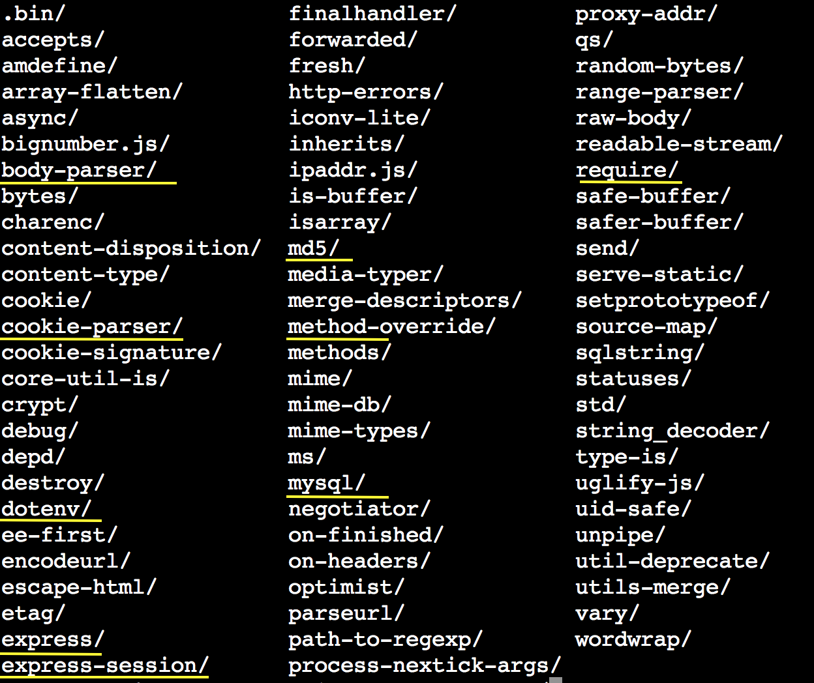
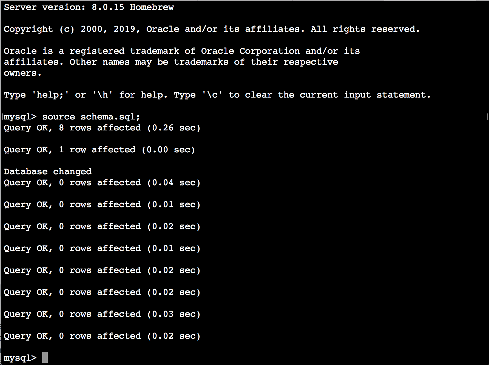
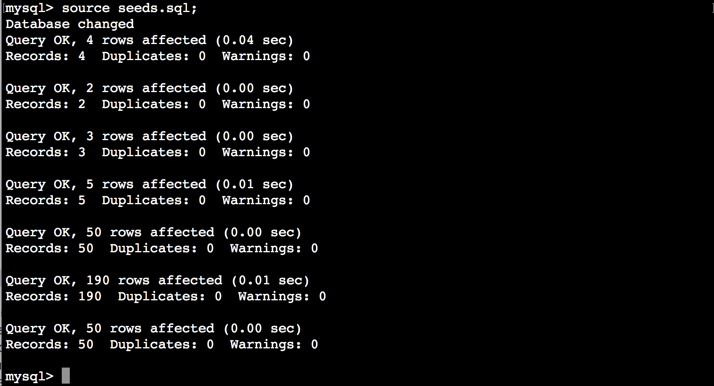
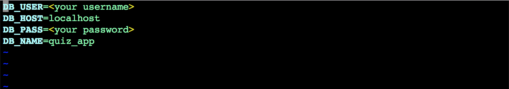
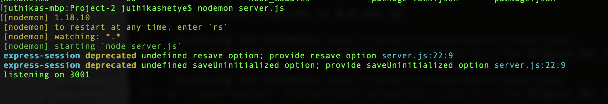
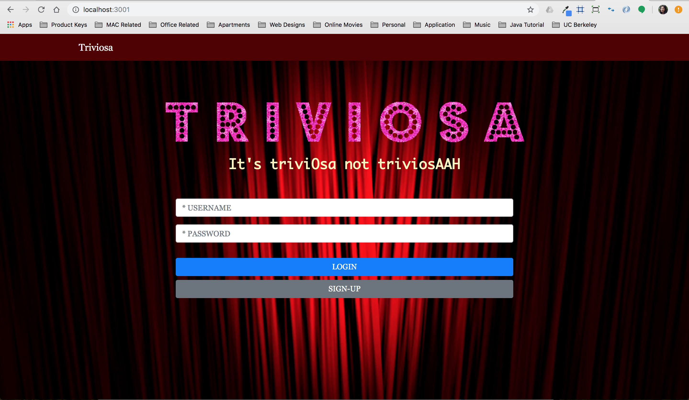

# Triviosa

## Description

* Triviosa is a single player trivia game.

* On sign-up the user creates an account with a unique username and selects a team of their choice. The player is then able to select a difficulty level to play a quiz related to the topic they choose.

* Each question correctly answered adds random points to both your and your team's score. At the end of each game, you can see your score, rank and the overall ranking of your team. You can also checkout the Leaderboard to see the scores and rankings of all the players and teams.

* This game was developed as a project for the UC Berkeley Coding Bootcamp, San Francisco.

## npm Packages Used

* [Require](https://www.npmjs.com/package/require)

* [MySQL](https://www.npmjs.com/package/mysql)

* [Express](https://www.npmjs.com/package/express)

* [Body-Parser](https://www.npmjs.com/package/body-parser)

* [Method-Override](https://www.npmjs.com/package/method-override)

* [Express-Session](https://www.npmjs.com/package/express-session)

* [Cookie Parser](https://www.npmjs.com/package/cookie-parser)

* [MD5](https://www.npmjs.com/package/md5)

* [DotEnv](https://www.npmjs.com/package/dotenv)

## System Requirements

1. NodeJS - version 10 and up

2. MySQL - version 8.0 

## Setting Up The Application

* After cloning this repository on your computer follow the steps mentioned below to get your app working.

### Install The Packages Listed 

* In your terminal, navigate to the Project-2 folder you just cloned and run `npm install` 

* After running `npm install`, the npm packages listed above should be downloaded inside the `node_modules` folder.

* In case you don't see the packages in `node_modules`, use the package links mentioned above to manually install the required packages. (see Figure 1)

<i>Figure 1: The yellow-lined modules are expected to be inside the node_modules folder for the app to work.</i>

### Building Your Database

* In your terminal navigate inside the `db` folder. Then login to your **MySQL** connection

* Once logged in, run `source schema.sql` followed by `source seeds.sql` (See Figures 2a and 2b)

* SQL Version required is 8.0 and up

<i>Figure 2a: source schema.sql</i>

<i>Figure 2b: source seeds.sql</i>

### Create Your `.env` File

* Navigate back to Project-2 folder and create a `.env` file. Inside this file, provide your database credentials. (See Figure 3)

<i>Figure 3: Information inside the .env file.</i>

### Running The App

* Navigate back to the main Project-2 folder and run `node server.js` or `nodemon server.js`

* On your browser go to `http://localhost:3001`

**_Voila!_** You now have Triviosa running in your browser!

## Credits

[Flaming Text](www.flamingtext.com) - for logo images.

[Orange Free Sounds](www.orangefreesounds.com) - for sounds.

[Trivia Questions](https://www.triviaquestionss.com/) & [Laff Gaff](http://laffgaff.com/) - for quiz questions.
